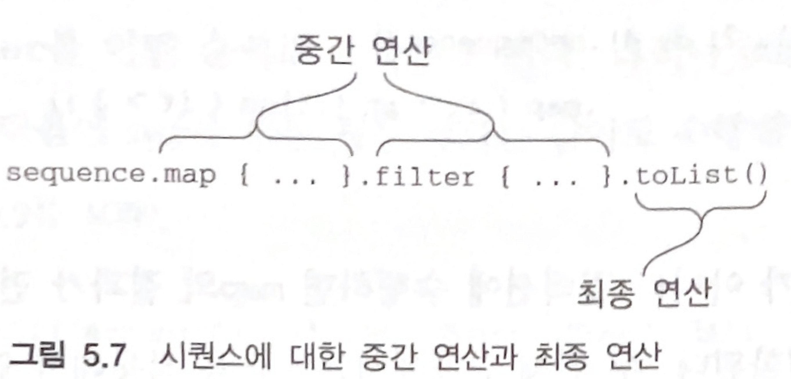
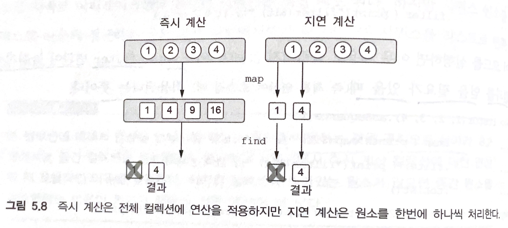
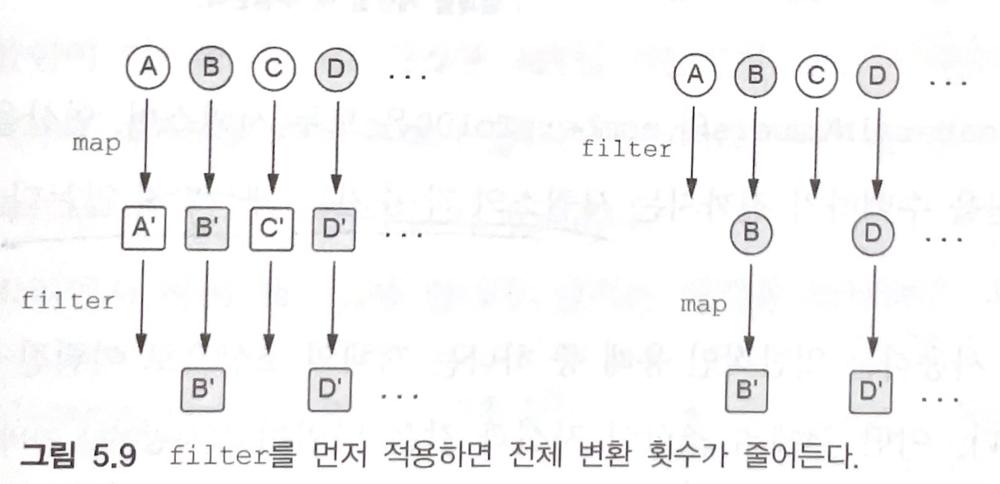

# 5장. 람다로 프로그래밍

<aside>
💡 **람다 식, 람다**는 기본적으로 다른 함수에 넘길 수 있는 작은 코드 조각을 뜻한다.

</aside>

# 지피티에게 물어보자 람다식, 람다식이란?

**람다식**은 익명 함수의 한 형태로, 이름이 없는 함수를 뜻합니다.

람다식은 코드 블록을 데이터로 취급할 수 있게 해주며, 다른 함수의 인자로 전달되거나 변수에 저장될 수 있습니다.

람다식은 주로 간결하고 일회성으로 사용되는 간단한 함수 정의에 유용합니다.

책에 좋은 의미가 있다.

일련의 동작을 변수에 저장하거나, 다른 함수에 넘겨야 하는 경우 익명 내부 클래스를 사용해 왔지만, 이젠 람다로 이것을 대체할 수 있다!!

그러니깐

“일련의 동작을 변수에 저장하거나, 다른 함수에 넘겨야 하는 경우 “

이럴 때 사용하는 게 람다.

함수를 값처럼 취급한다는 의미이다.

# 람다 대신 멤버 참조

```kotlin
val people = listOf(Person("Alice", 23), Person("Heejik", 26))

println(people.maxBy { it.age })   // 람다

println(people.maxBy(Person::age)) // 멤버 참조
```

함수나 프로퍼티를 반환하는 역할을 수행하는 람다는 멤버 참조로 대치가 가능핟.

# 람다 식의 문법

```kotlin
 { x: Int, y: Int -> x + y }
```

이게 람다 식이다.

여기저기 전달할 수 있는 동작의 모음.

함수에 인자로 넘기면서 정의하기도, 변수에 저장하기도 가능하다.

값으로 취급하니깐

```kotlin
val sum = { x: Int, y: Int -> x + y }
```

```kotlin
{ println(42) }()    // 1

run { println(42}    // 2
```

1 처럼 람다식을 선언과 동시에 직접 호출(`()`) 이 가능하다.

하지만 굳이? 읽기도 어렵고 쓸모도 없다.

하지만 이렇게 쓸 일이 있다면 2번 처럼 `run` 을 사용하면 가독성이 더 좋다.

코틀린에서 함수 호출에 람다식을 파라미터로 사용하면

괄호 외부에 중괄호로 바로 선언할 수 있다.

이것은 마지막 파라미터가 람다형태로 받을 때만 가능하다.

만약 2개 이상의 파라미터가 람다로 받는다면 이 땐 괄호내에 선언하는 게 더 보기가 좋다.

(누구는 괄호에, 누구는 외부에 차별하지말자.)

람다 식의 파라미터가 하나뿐이고 타입을 컴파일러가 추론이 가능할 때 `it` 으로 바로 해당 파라미터를 사용할 수 있다.

하지만 너무 남발하지 말자.

특히 람다가 중첩되면 `it` 이 어디 람다의 파라미터인지 파악하기 어렵다.

람다를 변수에 저장할 땐 파라미터 타입을 추론할 문맥이 존재하지 않는다. 따라서 무조건 명시(우리가 함수를 정의할 때도 파라미터에 타입은 무조건 명시하는 느낌)

```kotlin
val getAge = { p: Person -> p.age }
people.maxBy(getAge)
```

람다식의 본문이 여러 줄로 이뤄질 때 람다식의 결과는 본문의 맨 마지막에 있는 식

# 람다의 비용

실행(런타임) 시점에 코틀린 람다 호출에는 아무 부가 비용이 들지 않는다.

프로그램의 기본 구성 요소와 비슷한 성능을 가진다.

8장에 추가로 이유가 나온다고 하니 그때 자세히 알아보자.

# 멤버 참조(`::`)

개발하면서 종종 많이 사용해왔다.

`viewModel::getInfo`

요렇게,,

어떨 때 사용하냐면 함수의 인자로 함수를 넘길때(고차함수)에서 람다 대신 사용해왔다.

`{ viewModel.getInfo() }` →  `viewModel::getInfo`

이렇게 대신할 수 있다.

**그럼 이게 왜 좋은가?**

일단 넘기려는 코드가 함수인데, 그걸 또 람다로 감싸면?

중복되는 느낌이 있다.

람다도 함수이고 람다 내부도 함수이다. 기분이 좋지않다.

하지만 멤버 참조는 매우 깔끔하다.

그리고 람다 내부의 함수에 인자가 여러개라면? 그리고 딱히 변환없이 그냥 위임하는 경우라면?

아래 코드처럼.. 인자가 늘어나면 계속 추가해야한다. 수동적으로

```kotlin
navigateToLedgerDetail = { navOptions, ledgerId, isStaff ->
    homeNavController.navigateLedgerDetail(navOptions, ledgerId, isStaff)
}
```

그런데 멤버 참조를 쓰면

```kotlin
navigateToLedgerDetail = homeNavController::navigateLedgerDetail
```

굳.  알아서 인자가 잘 들어간다.

또 하나 멤버 참조로 변수를 선언할 수 있다.(이건 몰랐다..)

```kotlin
val getAge = Person::age
```

이게 된다. 그럼 이건 함수이다 타입은? `() → Int`

이렇게 변수에 할당한다는 건 결국 멤버 참조는 값을 생성한다는 의미이다.

난 기존엔 멤버 참조 메서드에 직접 접근해서 사용하는 줄 알았다.

값을 만드는 줄은 몰랐다.

그럼? 람다랑 다를 게 뭐야?

### 가독성말고 좋은 게 없잖아?(그걸로도 이미 쓸 이유지만)

`compose` 에서 `recomposition` 에서 차이를 경험한 적이 있다.

람다를 쓸 때보다 멤버 참조를 쓸 때 `recomposition` 이 적게 일어났다.

그래서 멤버 참조는 값을 새로 생성한다고 생각하지 않았다.(값이란 개념을 생각하지 않았다. 근데 생각해보면 함수의 인자로 들어갈 수 있는데 값이라고 유추했어야 하지 않나..?)

그럼 무슨 차이가 있길래? recomposition 에서 차이를 보였을까?

아래 코드를 실행해보자.

```kotlin
fun printJik() {
    println("JIK")
}

fun main() {
    val member1 = ::printJik
    val lambda1 = { printJik() }
    val member2 = ::printJik
    val lambda2 = { printJik() }

    println("member1.hashcode = ${member1.hashCode()}")
    println("lambda1.hashcode = ${lambda1.hashCode()}")
    println("member2.hashcode = ${member2.hashCode()}")
    println("lambda2.hashcode = ${lambda2.hashCode()}")
}
```

```kotlin
a.hashcode = 824655241
b.hashcode = 500977346
c.hashcode = 824655241
d.hashcode = 20132171
```

보면은 멤버 참조로 할당된 변수의 hashcode 값은 항상 동일했다.

하지만 람다는 보다시피 hashcode 값이 다르다.

이는 결국 멤버 참조는 계속 새로운 값을 생성 하는 게 아닌 단 **하나의** 값만 생성하는 걸 알 수 있다.

그래서 `recomposition` 에서 괜찮았구나…

# 컬렉션 함수형 API

```kotlin
people.filter { it.age == people.maxBy(Person::age)!!.age }
```

여기서 잘못된 게 뭘까?

만약에 `people` 리스트에 원소가 10만명이 있다면?

해당 시간 복잡도는 **10만 * 10만** 이 되어버린다.

그래서 람다 내부에 또 람다를 넘기면 겉으론 단순해보여도, 내부적으론 매우 복잡한 계산식이 될 때가 있다.

그러니 아래처럼 사용하자.

```kotlin
val maxAge = people.maxBy(Person::age)!!.age
people.filter { it.age == maxAge }
```

## groupBy

> 리스트를 여러 그룹으로 이뤄진 맵으로 변경

```kotlin
val people = listOf(Person("Alice", 31), Person("Bob", 29), Person("Carol", 31))
println(people.groupBy { it.age })

>> {31=[Person(name=Alice, age=31), Person(name=Carol, age=31)], 29=[Person(name=Bob, age=29)]}
```

이렇게 리스트의 특정 속성으로 그룹화 하고 싶다면 `groupBy` 를 사용하면 된다.

그럼 `key` 가 해당 속성의 값, `value` 는 해당 속성에 따라 그룹화된 원소들이 리스트 배열 안에 들어간다.

## flatMap, flatten

> 중첩된 컬렉션 안의 원소 처리

**`flatMap`**

```kotlin
val strings = listOf("abc", "def", "ghi")
println(strings.flatMap { it.toList() })

>> [a, b, c, d, e, f, g, h, i]

val strings = listOf(listOf('a', 'b', 'c'), listOf('c', 'd', 'f'))
println(strings.flatMap { it + 1 })

>> [a, b, c, 1, c, d, f, 1]
```

flatMap 의 인자로 받은 람다를 먼저 모든 객체에 실행한다. → `map`

해당 결과를 한 리스트로 모은다. → `flatten`

**`flatten`**

그런데 변형 없이 단순히 펼치고만 싶다면?

```kotlin
val strings = listOf(listOf('a', 'b', 'c'), listOf('c', 'd', 'f'))
println(strings.flatten())

>> [a, b, c, c, d, f]
```

## 지연 계산(lazy) 컬렉션 연산(`sequence`)

```kotlin
people.map(Person::name).filter { it.startsWith("A") }
```

위와 같이 코드가 있다면 리스트가 **2개**가 생성된다.

→ 연쇄 실행되면서 `map` 에서 리스트 반환. `filter` 에서 리스트 반환하기에

그런데 사실 우리가 필요한 건 마지막 결과인 리스트 **1개**이다.

이게 만약 people 의 원소 개수가 적으면 괜찮겠지만 많다면 성능상 좋지 않다.(메모리)

그러면 하나만 만들 수 없나?

```kotlin
people.asSequence()
  .map(Person::name)
  .filter { it.startsWith("A") }
  .toList()
```

이렇게 하면 된다.

이러면 마지막 `toList()` 에서 단 하나의 리스트만 생성된다.

sequence 인터페이스는 단지 한 번에 하나씩 열거될 수 있는 원소의 시퀀스를 표현할 뿐이다.

내부에 `iterator` 메서드 단 하나가 있으며 이를 통해, 시퀀스에서 원소 값을 얻는다.

어떻게 저게 가능할까?

시퀀스의 연산은 필요할 때 계산된다.

그래서 연쇄 실행할 때 중간 중간 결과를 저장하지 않는다.

### **시퀀스의 연산**

시퀀스는 중간 연산과 최종 연산으로 나뉜다.

중간 연산은 다른 시퀀스를 반환. → 해당 시퀀스는 이전의 시퀀스의 원소를 변환하는 방법을 안다.

최종 연산은 결과를 반환(결과는 앞선 계산을 수행해 얻을 수 있는 컬렉션, 원소, 숫자 또는 객체)



연산의 수행 순서를 보자.

```kotlin
listOf(1, 2, 3, 4).asSequence()
  .map { print("map($it) "); it * it }
  .filter { print("filter($it) "); it % 2 == 0 }
  .toList()

>> map(1) filter(1) map(2) filter(4) map(3) filter(9) map(4) filter(16) 
```

일반 컬렉션이라면 `map` 함수 모두 실행한 뒤, `filter` 함수를 실행한다.

하지만 시퀀스의 경우 모든 연산은 각 원소에 대해 순차적으로 저용된다.

첫 번째 원소 모든 연산 수행 → 두 번째 원소 모든 연산 수행 → …

그렇기 때문에, 원소에 연산을 차례대로 수행하다가 원하는 결과가 얻어지면 그 이후의 원소에 대한 연산은 이뤄지지 않을 수 있다.

```kotlin
listOf(1, 2, 3, 4)
	.asSequence()
  .map { it * it }
  .find { it > 3 }
```

여기서 `find` 는 최종 연산이다.(숫자를 반환하니)

이걸 일반 컬렉션에서의 계산 과정(즉시 계산)과 비교해보자.



이렇게 지연 계싼을 하면 원소 차례로 연산하기에, map 함수를 모두 수행하지 않는다.

→ 성능에 영향을 끼친다

이걸 다른 예시로 보면

```kotlin
val people = listOf(Person("Alice", 29), Person("Bob", 31), Person("Carol", 34), Person("David", 32))
    
// 1
people.asSequence()
    .map(Person::name)
    .filter { it.length < 4 }
    .toList()

// 2
people.asSequence()
    .filter { it.name.length < 4 }
    .map(Person::name)
    .toList()
```

1번과 2번의 결과는 차이가 없다. 하지만

연산 횟수에서 차이가 난다.



### **시퀀스를 만들어보자.**

지금까진 `asSequence()` 로 기존의 컬렉션을 비롯해서 만들었다.

바로 생성하고 싶으면

```kotlin
val naturalNumbers = generateSequence(0) { it + 1 }
val numbersTo100 = naturalNumbers.take(101)
val sum = numbersTo100.sum()
println(sum)
```

`naturalNumbers`, `numbersTo100` 모두 시퀀스며, 연산을 지연 계산한다.

그래서 최종 연산하기까진 시퀀스의 숫자는 계산되지 않는다.

(sum() 이 최종 연산이다.)

위의 예시말고 또 다른 예시를 하나 보자.

```kotlin
fun File.isInsideHiddenDirectory() = 
        generateSequence(this) { it.parentFile }.any { it.isHidden }

val file = File("path/to/file")
println(file.isInsideHiddenDirectory())
```

## 자바 함수형 인터페이스 활용

> 자바로 작성된 API 에서 람다를 사용해보자

아래는 안드로이드 개발을 시작하면 초기에 접하는 구문이다.

```kotlin
button.setOnClickListener { view -> /* ... */ }
```

여기서 `setOnClickListener` 를 들여다 보자

```java
public void setOnClickListener(@Nullable OnClickListener l) {
	// ...
}
```

필요한 인자의 타입은 `OnClickListener` 이다

그럼 `OnClickListener` 를 들여다 보자

```java
public interface OnClickListener {
  void onClick(View v);
}
```

놀랍게도 인터페이스이고, `onClick` 이란 메서드가 선언되어 있다.

그럼 자바8에선 해당 코드를 어떻게 짤까? (람다를 쓰지 않고)

```java
button.setOnClickListener(new OnClickListener () {
    @Override
    public void onClick(View v) {
        println("무명(익명) 클래스로 구현")
    }
}
```

이렇게 무명 클래스의 인스턴스를 만들어야 한다.

하지만 코틀린에선 위와 같이 람다로 넘길 수 있다.

```java
button.setOnClickListener {
    println("코틀린에서 람다로 구현")
}
```

이게 가능한 이유는 OnClickListener 가 **함수형 인터페이스 또는 SAM 인터페이스 이기 때문이다.**

→ 단 하나의 추상 메서드를 가지는 인터페이스를 의미

코틀린에선 함수형 인터페이스를 인자로 취하는 자바 메서드를 호출할 땐
람다로 인터페이스 내부 메서드를 정의할 수 있다.

또 다른 예시로

```java
void postponeComputation(int delay, Runnable computation)
```

위 자바의 함수를 아래의 kotlin 코드로 호출이 가능하다

```kotlin
postponeComputation(1000) { println(42 } 
```

이렇게도 가능하다

```kotlin
postponeComputation(1000, object: Runnable {
    override fun run() {
        println(42)
    }
})
```

그럼 지금까지 본 게 어떤 걸 의미하냐면

<aside>
💡 컴파일러가 람다를 자동으로 무명 클래스의 인스턴스로 만들어준다.


</aside>

여기서 람다 본문은 함수형 인터페이스의 유일한 메서드 본문으로 사용된다.

하지만 차이는 존재한다.

익명 클래스의 인스턴스를 직접 만들어서 넘기면 해당 함수를 호출할 때마다 새로 생성한다.

→ but. 람다는 컴파일러가 자동으로 생성한 인스턴스를 새로 생성하지 않고, 반복 사용한다.

여기서도 예외는 있다.

```kotlin
fun handleComputation(id: String) {
    postponeComputation(1000) { println(id) }
}
```

이렇게 하면  람다에서 `id`  변수를 포획한다.

그럼 해당 `handleComputation` 함수를 호출할 때마다 새로운 Runnable 인스턴스가 생성된다.

→ 왜냐면 함수가 호출할 때마다 `id` 값이 바뀔 수 있으니

### SAM 생성자: 람다를 함수형 인터페이스로 명시적으로 변경

> 컴파일러가 람다를 자동으로 함수형 인터페이스로 변환해주지만, 그렇지 못하는 경우엔 수동으로 해야한다.

```kotlin
fun createAllDoneRunnable(): Runnable {
    return { println("All done!") } // Type mismatch
}
```

print 를 가지는 람다를 Runnable 인스턴스로 자동으로 컴파일이 변환해주지 않는다.

그럼 어떻게 할 수 있냐면

```kotlin
fun createAllDoneRunnable(): Runnable {
    return Runnable { println("All done!") }
}
```

이렇게 람다 앞에 사용하는 함수형 인터페이스의 이름을 붙이면 된다.

이걸 SAM 생성자라고 하며, 람다는 함수형 인터페이스의 유일한 추상 메서드의 본문에 사용된다.

유용한 용례로는

```kotlin
val listener = OnClickListener { view ->
    val text = when (view.id) {
        R.id.button1 -> "Button 1 clicked"
        R.id.button2 -> "Button 2 clicked"
        else -> "Unknown button clicked"
    }
    taost(text)
}

findViewById<Button>(R.id.button1).setOnClickListener(listener)
findViewById<Button>(R.id.button2).setOnClickListener(listener)
```

이렇게 사용될 수 있다

### 수신 객체 지정 람다

> 책에선 `with` 과 `apply`  관련된 내용이 나오지만, 아는 내용이기에 빼고 색다른 내용만

```kotlin
fun alphabet() = with(StringBuilder()) {
    for (letter in 'A'..'Z') {
        append(letter)
    }
    append("\nNow I know the alphabet!")
    toString()
}
```

`with` 을 사용해서 `StringBuilder` 를 수신 객체로 받아, 코드를 깔끔히 한 예시이다.

그런데 이걸

```kotlin
fun alphabet() = buildString {
    for (letter in 'A'..'Z') {
        append(letter)
    }
    append("\nNow I know the alphabet!")
}
```

이렇게가 가능하다

내부적으로 `StringBuilder` 를 만들고 `toString()` 까지 알아서 해준다

```kotlin
inline fun buildString(builderAction: StringBuilder.() -> Unit): String {
    contract { callsInPlace(builderAction, InvocationKind.EXACTLY_ONCE) }
    // !!!
    return StringBuilder().apply(builderAction).toString()
}
```