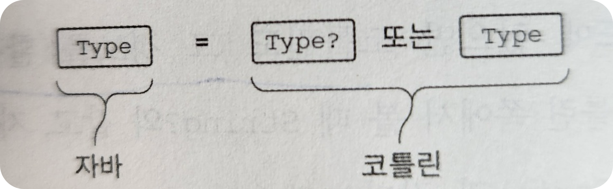
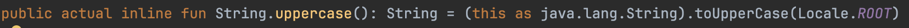
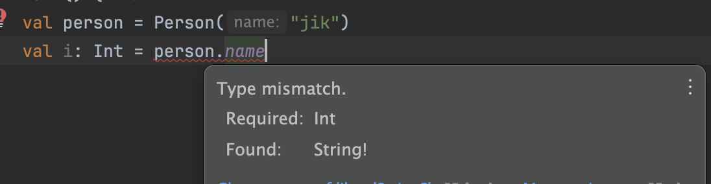
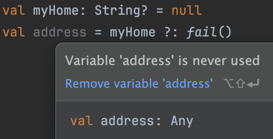
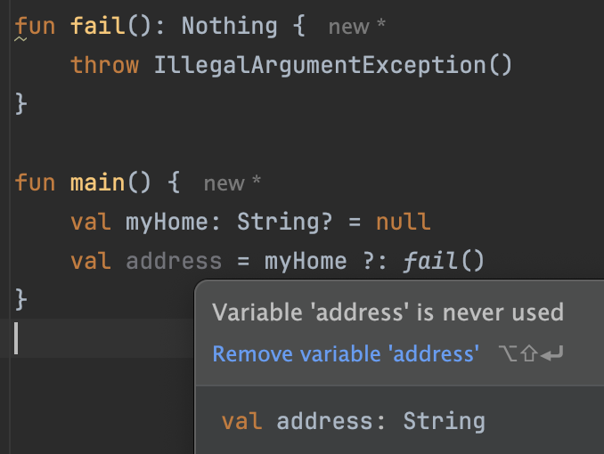

# 6장. 코틀린 타입 시스템

# 널 가능성

> 이 부분에선 자바와 kotlin 에서의 null 을 다루는 방식의 차이 및 코틀린만의 Null 을 더 잘 다루는 방법들을 보여준다.
> 하지만 이미 알고 있는 부분은 제외한다.

## !! (not-null assertion)

> 널이 아님을 단언한다.

근본적으로 `!!` 는 컴파일러에게 “나는 이 값이 `null` 이 아님을 잘 알고 있다. 내가 잘못 생각했다면 예외가 발생해도 감수하겠다” 라고 말하는 것

`!!` 가 약간 무례해 보인다.

마치 컴파일러에게 소리를 지르는 느낌을 준다.

→ 이건 사실 의도한 것이다.

→ 코틀린 설계자들은 컴파일러가 검증할 수 없는 단언을 사용하기보단 더 나은 방법을 찾아보라는 의도를 넌지시 표현하려고 `!!` 라는 못생긴 기호를 택했다

그럼 왜 있을까?

→ 때론 유용할 때가 있다.

예를 들어

```kotlin
 var name: String? = "Hee"

fun a() = name != null

fun b() {
    print(name.length) // Only safe (?.) or non-null asserted (!!.) calls are allowed on a nullable receiver of type String?
}

fun c() {
    a()
    b()
}
```

`a` 라는 함수 다음에 `b` 함수가 나올게 명시되어 있다. 이는 확실하다.

하지만? 컴파일러는 그런 연관 관계를 알지 못한다.

→ 그래서 `b` 함수에서 name 변수는 nullable 이다.

그럼 b 에서 `null check` 를 또 해야한다.

그러고 싶진 않다. 이미 null 이 아님을 확신할 수 있다.

그럴때 `!!` 쓰면 되는 것

그래도  `!!` 쓰고 싶지 않다면 아래처럼 하면 된다.

중복이긴 하지만, 나중에 `a` 함수가 변경될 수 있으니, 이렇게 안전 장치를 걸어두는 것도 좋은 방법이다.

```kotlin
// 1
fun b() {
    print(name!!.length)
}

// 2
fun b() {
    print(name?.length ?: return)
}
```

`!!`  로 `NPE` 가 일어나도 어떤 객체(프로퍼티)에서 예외가 발생한 지는 스택 트레이스에서 알려주지 않는다.

단순히 해당 `!!` 이 발생된 줄을 알려준다.

그래서 아래와 같이 한 줄에 함께 쓰는 일을 하지말자.

```kotlin
person.company!!.address!!.country
```

## 나중에 초기화할 프로퍼티

> 때론 `null` 이 될 필요가 없는 프로퍼티이지만, 초기화를 피하기 위해 `null` 로 선언하는 경우가 있다.

```kotlin
class MyService {
    fun performAction(): String = "foo"
}

class MyTest {
    private var myService: MyService? = null

    @Before
    fun setUp() {
        myService = MyService()
    }

    @Test
    fun testAction() {
        Assert.assertEquals("foo", myService!!.performAction())
    }
}
```

위는 테스트 코드 예시이다.

예처럼 `Before`에서 초기화를 진행하고 싶지만,  `Before` 에서 myService 를 선언하면 testAction 에서 이를 사용할 수 없다.

그렇기에 위처럼 어쩔 수 없이(`null` 일 필요가 없지만) null 로 선언하게 된다.

→ 그러면 `myService` 를 사용할 때 마다 널 체크나 !! 를 사용해야 한다.

```kotlin
class MyService {
    fun performAction(): String = "foo"
}

class MyTest {
    private lateinit var myService: MyService

    @Before
    fun setUp() {
        myService = MyService()
    }

    @Test
    fun testAction() {
        Assert.assertEquals("foo", myService.performAction())
    }
}
```

이렇게 `lateinit` 를 쓰면 된다.

→ `lateinit` 을 알고는 있었지만, 코드짤 땐 잘 쓰지를 않았다. 분명 위와 같은 경우도 있었던 것 같은데
염두에 두고 있지 않아서 인 듯하다.

## 타입 파라미터의 널 가능성

> 타입 파라미터는 nullable 한 타입도 추론이 가능하다

```kotlin
fun <T> printHashCode(t: T) {
    println(t?.hashCode())
}

>>> printHashCode(null)
null
```

위처럼 하면 T 는 `Any?` 로 추론된다.

하지만 `T` 를 `non null` 로 보장받고 싶다면?

```kotlin
fun <T : Any> printHashCode(t: T) {
    println(t.hashCode())
}

>>> printHashCode(null)
compile error : Null can not be a value of a non -null type TypeVariable(T)
```

이 처럼 타입 상한을 `non-null` 로 지정하면 된다.

## 널 가능성과 자바

> 자바와 코틀린를 함께 사용할 때 널처리를 어떻게 할지 알아보자

자바는 `nullable` 지원 X

코틀린은 `nullable` 지원 O

### Annotation

자바에선 코드에 `non-null` 과 `nullable` 을 각각 나타내는 annotation 이 존재한다.

- `@Nullable`
- `@NotNull`

코틀린은 해당 annotation 을 인식하고 이해해서 널 가능성을 체크할 수 있다.

### 플랫폼 타입

> annotation 이 없는 경우엔 자바의 타입은 코틀린의 **플랫폼 타입**이 된다.

플랫폼 타입이란 코틀린이 널 관련 정보를 알 수 없는 타입을 말한다.

→ 자바

자바에서 타입이 `null` 인지, 아닌지 코틀린 컴파일러는 알 수 없다.

→ 그렇기에 널 처리에 대한 책임은 개발자에게 있다.

→ 잘못 사용했다면 `NPE` 가 발생한다



자바와 코틀린 타입간의 null 처리

예시를 보자.

```java
// 자바
public class Person {
    private final String name;

    public Person(String name) {
        this.name = name;
    }

    public String getName() {
        return name;
    }
}
```

위와 같은 자바로 작성된 클래스가 있고,

```kotlin
// 코틀린
fun yellAt(person: Person) {
    println(person.name.uppercase() + "!!!")
}

fun main() {
    yellAt(Person(null))
}
```

아래처럼 코틀린으로 위 Person 을 사용해보자

위 main 함수를 실행하면

> NullPointerException: [person.name](http://person.name/) must not be null

해당 런타임 에러가 발생한다

왜냐면 `uppercase` 함수는 다음처럼 `String` 타입의 확장함수이다.



하지만 위 코드에선 [person.name](http://person.name) 의 값이 `null` 이라서 위 에러가 발생.

이처럼 코틀린 컴파일러는 자바 코드의 널 가능성을 알지 못한다.

위처럼 코틀린에선 `non-null` 을 가정하고 코드를 짜지만 자바에선 `null` 을 반환할 수도 있다.

따라서, 자바 코드에서 널 가능성을 항상 염두에 두고, 확인한 뒤에 널 가능성이 있다면 아래처럼 널 체크를 해야한다.

```kotlin
// 코틀린
fun yellAt(person: Person) {
    println((person.name ?: "AnyOne").uppercase() + "!!!")
}
```

자바 API 를 다룰 땐 대부분의 라이브러리들이 널 관련 `annotation` 을 쓰지 않기에, 내부 코드나 문서를 확인한 뒤, 널 가능성을 살펴봐야한다.

(annotation 을 쓰지 않는다고, `non-null` 을 의미하는 게 아니다.)

### 그럼 왜 코틀린은 플랫폼 타입을 도입했을까?

> 모든 자바 타입을 `nullable` 로 다루면 되지 않을까?

물론 가능하고, 더 안전해진다.

하지만, 널이 될 수 없는 값에도 널 체크가 강제된다.

만약 모두 nullable 로 다룬다면

→ 제네릭을 다룰 때 상황은 더 나빠지는데, 자바의 `ArrayList<String>` 을 코틀린에선 `ArrayList<String?>?` 으로 다룰 것이다. 그러면 해당 배열과 내부 원소에 접근할
때마다 `null check` 가 강제된다.

널 안전성으로 얻는 이익보다, 검사에 드는 비용이 훨씬 커진다.
→ 모든 타입의 값에 항상 널 검사를 작성하는 건 너무 성가신 일이다.

<aside>
💡 그래서 코틀린 설계자들은 자바의 타입을 가져온 경우, 프로그래머에게 그 타입을 처리할 책임을 부여하는 실용적인 접근 방법을 선택.


</aside>

코틀린에서는 플랫폼 타입을 선언할 수는 없다.

→ 자바 코드에서 가져온 타입만 플랫폼 타입

하지만 오류 메시지에서는 볼 수 있다.



여기서 `String!` 는 뭘까?

→ null 가능성에 대해 아무런 정보가 없다는 뜻이다.

# 코틀린의 원시 타입

## 원시 타입

자바는 원시 타입과 참조 타입을 구분한다.

### 잠시 원시 타입과 참조 타입을 간단하게 알아보자.

원시 타입에는 값 자체,

참조 타입에는 메모리상의 객체 위치

서로의 장 단점이 존재

원시 타입

- 메모리에 직접 저장하기에 접근 속도가 빠르다.
- 고정된 메모리 크기를 가진다. → 효율적

참조 타입

- 객체가 된다. → 메서드와 속성을 가질 수 있다.
- 컬렉션 내부 타입에 들어갈 수 있다.
    - → 제네릭에 들어갈 수 있다.
        - 제네릭의 내부 데이터 타입은 타입소거를 통해 런타임 시점에 object 로 변환
        - 그렇기에 참조 타입만 들어갈 수 있음 (원시타입은 object 로 변환되지 않기에)
- null 값을 가질 수 있다.

### 코틀린은?

코틀린에선 그런 생각을 해본적이 없다.

정수 타입이면 Int 가 끝. Integer 이란 건 없다.

→ 그럼 코틀린은 항상 참조 타입으로 취하는 걸까?

그러면 너무 비효율적이니, 그렇지 않고 컴파일러가 판단하에 가장 효율적인 방식으로 표현된다.

Int 타입은 자바의 Int 타입으로 컴파일 되지만, 이게 불가능한 경우(제네릭)엔 Integer 타입으로 들어간다.

### 널이 될 수 있는 원시 타입: Int?, Boolean? …

위에서 봤듯 참조 타입만 Null 이 가능하다

그럼 코틀린에서 `Int?`  타입을 선언한다면? → 이는 래퍼 타입(참조 타입)으로 컴파일된다.

또한 제네릭에서 타입으로 `Int` 를 넘기면 → → 이는 래퍼 타입(참조 타입)으로 컴파일된다.

### Any, Any?: 최상위 타입

자바엔 Object, 코틀린엔 Any 가 최상위 타입

자바의 Object 는 코틀린에서 Any 로 취급(사실 Any! 가 더 정확하다)

코틀린의 Any 는 자바의 Object 로 컴파일

앞서 본 `toString`, `equals`, `hashCode` 는 사실 Any 에 있는 메서드이고 이를 상속한 것

### Unit 타입: 코틀린의 void

> 대부분은 동일하다.

그렇다면 코틀린의 Unit 과 자바의 void 차이는 무엇일까?

Unit 을 타입 인자로 쓸 수 있고, Unit 타입에 속한 값은 하나이며, 이 이름은 Unit

Unit 타입을 반환하는  함수는 묵시적으로 Unit 값을 반환한다.

→ 이게 뭐냐면

```kotlin
fun printJik(): Unit {
    println("JIKKKK")
}
```

위 코드는 사실 `return Unit` 생략된 코드이다.

이 특성이 가지는 장점은 언제일까?

```kotlin
interface Processor<T> {
    fun process(): T
}
```

위와 같은 인터페이스가 있다고 치자.

그럼 다양한 곳에서 이를 구현하고 오버라이드할 것이다.

여기서 반환값이 없는 함수를 구현하고 싶다면?

```kotlin
class NoResultProcessor: Processor<Unit> {
    override fun process() {
        // 업무 처리
    }
}
```

이렇게 할 수 있다.

왜냐면 `return Unit` 이 생략된 함수이기에 사실은 T 타입으로 return 을 하고 있는 것이다.

자바에서 이를 한다면?

- 인터페이스를 분리하거나
- `java.lang.Void` 타입(void 가 아니다.)을 타입 파라미터로 사용하고, `return null` 을 명시해야 한다.

코틀린에서는 왜 이름이 `Unit` 일까? `Void` 가 아니고

Unit 과 Void 의 가장 큰 차이는 인스턴스의 유무이다.

Unit 은 Unit 이란 인스턴스를 갖는다.

함수형 프로그래밍에서 전통적으로 Unit 이 ‘단 하나의 인스턴스만 갖는 타입’ 을 의미해왔다.

### Nothing 타입: 이 함수는 결코 정상적으로 끝나지 않는다.

> 때론 함수에 “반환” 자체가 필요하지 않는 경우가 있다.

```kotlin
**fun fail() {
    throw IllegalArgumentException()
}**
```

이 코드가 반환값이 필요할까? 반환 자체가 될까?

반환이 필요없고 무조건 예외를 던진다.

그런데 예의 반환 타입이 존재한다. → `Unit`



이러면? address 는 Any 타입으로 타입 추론이 된다.

여기서 `String` 과 fail 의 반환값인 `Unit` 의 공통 상위 타입은 Any 라서 Any 타입이 추론된다.

그런데 우리는 사실 address 과 `String` 타입만 올 수 있는 걸 안다. 왜냐면 String 이 아니면 예외를 던지니

그럼 여기서 쓸 수 있는 게 `Nothing` 이다



fail 의 반환 타입을 `Nothing`   으로 하면 해당 함수는 반환을 하지 않는 걸 의미한다.

그래서 `address` 변수 타입이 `fail` 함수의 반환에 영향을 받지 않는다.

## 컬렉션과 배열

### 읽기 전용과 변경 가능한 컬렉션

```kotlin
val list: List<Int>
```

불변이 아니다. 읽기 전용이지
내부 원소가 변경될 수 있다. 예를 들어

```kotlin
fun main() {
    val mutableList: MutableList<Int> = mutableListOf(1, 2, 3)
    val list: List<Int> = mutableList

    mutableList.add(4)

    println(list)
}

// [1, 2, 3, 4]
```

그래서 읽기 전용(List<T>)이라고 해서 **thread safe**한 것은 아니다.

### 코틀린 컬렉션과 자바

[https://jik3410.tistory.com/18](https://jik3410.tistory.com/18)

코틀린 컬렉션과 자바 컬렉션은 호환이 잘 되어있다.

그래서 코틀린 읽기 전용 컬렉션을 자바 컬렉션으로 넘길 수 있다.

그런데 자바 컬렉션은 읽기 전용이라는 개념이 없어서 변경이 가능하다.

그렇기에 코틀린에서 자바 코드에 List 로 넘겨도 자바 코드에선 그냥 내부에 원소를 추가할 수가 있다.

코틀린 컴파일러가 이를 막을 순 없기에, 자바 코드에서 컬렉션을 변경할지 여부에 따라 올바른 파라미터 타입을 사용할 책임은 개발자에게 있다.

예를 들어,

코틀린에선 읽기 전용(`Collection`)으로 리스트를 만들었는데, 자바에서 해당 리스트 내부를 변경할 가능성이 있다면
코틀린에서 그냥 변경 가능 리스트(`MutableCollection`)로 만드는게 낫다.

오히려 코드를 읽는 개발자와 추후의 나에게 인지부조화를 오게 한다.

(추가로 코틀린에선 `non-null` 타입의 Collection 타입이라도 자바에 넘겨주면 `null` 을 넣을 수도 있다.)

### 객체의 배열과 원시 타입의 배열

코틀린에서 `Array<Int>` 타입으로 배열을 선언하면 해당 배열은 자바의 박싱된 정수의 배열(`java.lang.Integer []`)이다.

그래서 박싱하지 않은 원시 타입의 배열이 필요하다면 `IntArray`, `BooleanArray` 등과 같은 특별한 배열 클래스를 사용해야한다. 해당 배열들이 컴파일 되면 자바 원시 타입
배열인 `int []`, `boolean []` 등으로 컴파일 된다. 그래서 효율적!